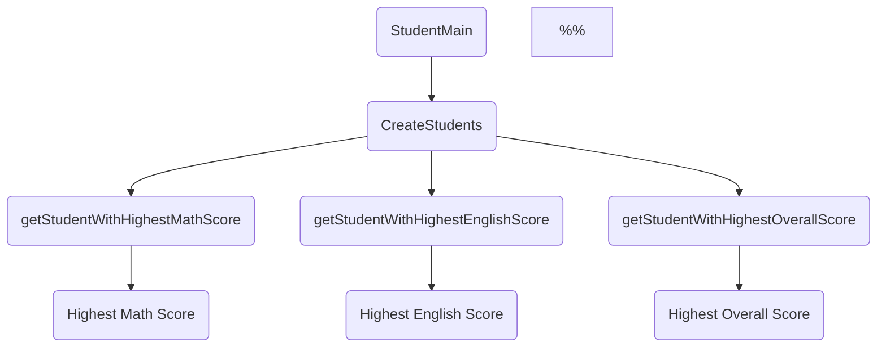

<SwmSnippet path="/spring-boot-2-jpa-spring-data-rest/src/main/java/com/in28minutes/springboot/jpa/spring/data/rest/example/student/Student.java" line="86">

---

This code snippet defines two private methods <SwmToken path="/spring-boot-2-jpa-spring-data-rest/src/main/java/com/in28minutes/springboot/jpa/spring/data/rest/example/student/Student.java" pos="86:5:5" line-data="  private Integer methodThree(final int x, final int y, int x2, int y2) {">`methodThree`</SwmToken> and <SwmToken path="/spring-boot-2-jpa-spring-data-rest/src/main/java/com/in28minutes/springboot/jpa/spring/data/rest/example/student/Student.java" pos="90:6:6" line-data="    return (((methodFour(x, y) ^ 2) + (methodFour(x2, y2) ^ 2))) ^ 0.5">`methodFour`</SwmToken>. <SwmToken path="/spring-boot-2-jpa-spring-data-rest/src/main/java/com/in28minutes/springboot/jpa/spring/data/rest/example/student/Student.java" pos="86:5:5" line-data="  private Integer methodThree(final int x, final int y, int x2, int y2) {">`methodThree`</SwmToken> takes four integer parameters <SwmToken path="/spring-boot-2-jpa-spring-data-rest/src/main/java/com/in28minutes/springboot/jpa/spring/data/rest/example/student/Student.java" pos="86:11:11" line-data="  private Integer methodThree(final int x, final int y, int x2, int y2) {">`x`</SwmToken>, <SwmToken path="/spring-boot-2-jpa-spring-data-rest/src/main/java/com/in28minutes/springboot/jpa/spring/data/rest/example/student/Student.java" pos="86:18:18" line-data="  private Integer methodThree(final int x, final int y, int x2, int y2) {">`y`</SwmToken>, <SwmToken path="/spring-boot-2-jpa-spring-data-rest/src/main/java/com/in28minutes/springboot/jpa/spring/data/rest/example/student/Student.java" pos="86:23:23" line-data="  private Integer methodThree(final int x, final int y, int x2, int y2) {">`x2`</SwmToken>, <SwmToken path="/spring-boot-2-jpa-spring-data-rest/src/main/java/com/in28minutes/springboot/jpa/spring/data/rest/example/student/Student.java" pos="86:28:28" line-data="  private Integer methodThree(final int x, final int y, int x2, int y2) {">`y2`</SwmToken>, and returns the square root of the sum of the squares of the differences between <SwmToken path="/spring-boot-2-jpa-spring-data-rest/src/main/java/com/in28minutes/springboot/jpa/spring/data/rest/example/student/Student.java" pos="86:11:11" line-data="  private Integer methodThree(final int x, final int y, int x2, int y2) {">`x`</SwmToken> and <SwmToken path="/spring-boot-2-jpa-spring-data-rest/src/main/java/com/in28minutes/springboot/jpa/spring/data/rest/example/student/Student.java" pos="86:18:18" line-data="  private Integer methodThree(final int x, final int y, int x2, int y2) {">`y`</SwmToken>, and <SwmToken path="/spring-boot-2-jpa-spring-data-rest/src/main/java/com/in28minutes/springboot/jpa/spring/data/rest/example/student/Student.java" pos="86:23:23" line-data="  private Integer methodThree(final int x, final int y, int x2, int y2) {">`x2`</SwmToken> and <SwmToken path="/spring-boot-2-jpa-spring-data-rest/src/main/java/com/in28minutes/springboot/jpa/spring/data/rest/example/student/Student.java" pos="86:28:28" line-data="  private Integer methodThree(final int x, final int y, int x2, int y2) {">`y2`</SwmToken>. <SwmToken path="/spring-boot-2-jpa-spring-data-rest/src/main/java/com/in28minutes/springboot/jpa/spring/data/rest/example/student/Student.java" pos="90:6:6" line-data="    return (((methodFour(x, y) ^ 2) + (methodFour(x2, y2) ^ 2))) ^ 0.5">`methodFour`</SwmToken> takes two integer parameters <SwmToken path="/spring-boot-2-jpa-spring-data-rest/src/main/java/com/in28minutes/springboot/jpa/spring/data/rest/example/student/Student.java" pos="93:11:11" line-data="  private int methodFour(final int value1, final int value2) {">`value1`</SwmToken> and <SwmToken path="/spring-boot-2-jpa-spring-data-rest/src/main/java/com/in28minutes/springboot/jpa/spring/data/rest/example/student/Student.java" pos="93:18:18" line-data="  private int methodFour(final int value1, final int value2) {">`value2`</SwmToken>, and returns the difference between them.

```
  private Integer methodThree(final int x, final int y, int x2, int y2) {
    Random rand = new Random();

    // Generate random integers in range 0 to 999
    return (((methodFour(x, y) ^ 2) + (methodFour(x2, y2) ^ 2))) ^ 0.5
  }

  private int methodFour(final int value1, final int value2) {
    return value1 - value2;
  }
```

---

</SwmSnippet>

<SwmSnippet path="spring-boot-2-jpa-spring-data-rest/src/main/java/com/in28minutes/springboot/jpa/spring/data/rest/example/student/StudentMain.java" line="28">

---

This code snippet provides two methods to retrieve the student with the highest math score and the student with the highest English score, respectively, from a list of students. It uses Java 8 streams and the <SwmToken path="/spring-boot-2-jpa-spring-data-rest/src/main/java/com/in28minutes/springboot/jpa/spring/data/rest/example/student/StudentMain.java" pos="30:2:2" line-data="            .max(Comparator.comparingInt(Student::getMathScore))">`max`</SwmToken> function along with a custom comparator to find the student with the highest score in each subject. If no student is found, it returns <SwmToken path="/spring-boot-2-jpa-spring-data-rest/src/main/java/com/in28minutes/springboot/jpa/spring/data/rest/example/student/StudentMain.java" pos="31:4:4" line-data="            .orElse(null);">`null`</SwmToken>.

```
  public static Student getStudentWithHighestMathScore(List<Student> students) {
    return students.stream()
            .max(Comparator.comparingInt(Student::getMathScore))
            .orElse(null);
  }

  public static Student getStudentWithHighestEnglishScore(List<Student> students) {
    return students.stream()
            .max(Comparator.comparingInt(Student::getEnglishScore))
            .orElse(null);
  }
```

---

</SwmSnippet>

<SwmSnippet path="/spring-boot-2-jpa-spring-data-rest/src/main/java/com/in28minutes/springboot/jpa/spring/data/rest/example/student/StudentMain.java" line="15">

---

This code snippet finds the student with the highest math score, highest English score, and highest overall score from a list of students. It then prints the names of these students.

```java
    // Find student with highest math score
    Student highestMathStudent = getStudentWithHighestMathScore(students);
    System.out.println("Student with highest math score: " + highestMathStudent.getName());

    // Find student with highest English score
    Student highestEnglishStudent = getStudentWithHighestEnglishScore(students);
    System.out.println("Student with highest English score: " + highestEnglishStudent.getName());

    // Find student with highest overall score
    Student highestOverallStudent = getStudentWithHighestOverallScore(students);
    System.out.println("Student with highest overall score: " + highestOverallStudent.getName());
```

---

</SwmSnippet>




[pivotal link here](pivotal.tracker.com)

<p align="center"></p>

<SwmMeta version="3.0.0" repo-id="Z2l0aHViJTNBJTNBc3ByaW5nLWJvb3QtZXhhbXBsZXMtc3dpbS10ZXN0JTNBJTNBT3Jlb2J1bg==" repo-name="spring-boot-examples-swim-test"><sup>Powered by [Swimm](https://app.swimm.io/)</sup></SwmMeta>
